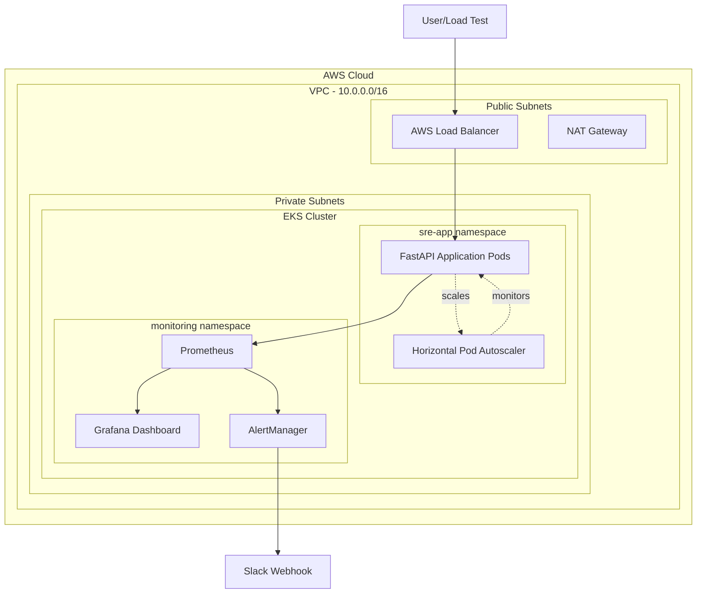
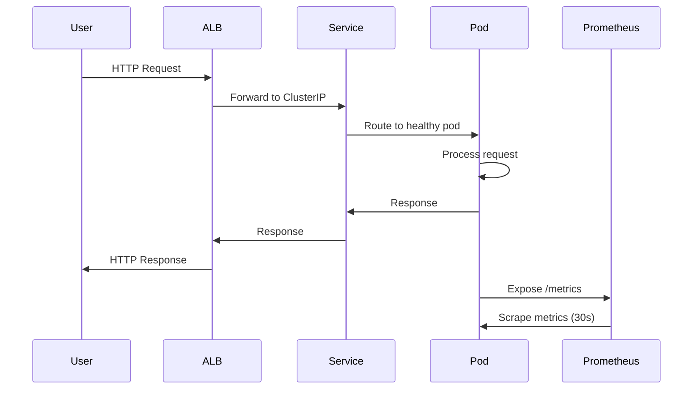
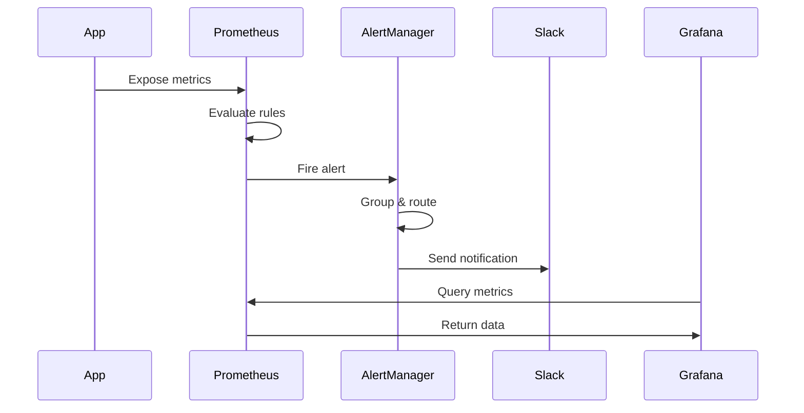

# Architecture Overview

## System Architecture

This document describes the complete architecture of the SRE Showcase project.

---

## High-Level Architecture



---

## Component Details

1. **AWS Infrastructure Layer**

    **VPC (Virtual Private Cloud)**

    - **CIDR**: 10.0.0.0/16
    - **Subnets**:
        - Public: 10.0.0.0/20, 10.0.16.0/20 (2 AZs)
        - Private: 10.0.32.0/20, 10.0.48.0/20 (2 AZs)
    - **NAT Gateway**: Single gateway for cost optimization
    - **Internet Gateway**: For public subnet access

    **EKS (Elastic Kubernetes Service)**

    - **Version**: 1.28
    - **Control Plane**: Managed by AWS
    - **Node Group**:
        - Instance Type: t3.small
        - Capacity Type: SPOT (70% cost savings)
        - Min: 1, Desired: 2, Max: 3
        - Auto-scaling enabled

1. **Kubernetes Layer**

    **Namespaces**

    **sre-app**

    - Application deployment
    - Services and ingress
    - Horizontal Pod Autoscaler
    - Pod Disruption Budget

    **monitoring**

    - Prometheus
    - Grafana
    - AlertManager

    **kube-system**

    - Metrics Server
    - CoreDNS
    - kube-proxy

1. **Application Layer**

    **FastAPI Application**

    **Container Image**: ⁠`ghcr.io/username/sre-showcase/sre-app:latest`

    **Endpoints**:

    - ⁠`/` - Root endpoint
    - ⁠`/health` - Liveness probe
    - ⁠`/ready` - Readiness probe
    - ⁠`/metrics` - Prometheus metrics
    - ⁠`/api/data` - Sample API endpoint
    - ⁠`/api/status` - Application status
    - ⁠`/api/flaky` - Intentionally flaky (for testing)
    - `⁠/api/slow` - Intentionally slow (for testing)

    **Resources**:

    ```bash
    requests:
    cpu:  100m
    memory:  128Mi
    limits:
    cpu:  500m
    memory:  512Mi
    ```

    **Probes**:

    - Liveness: `⁠/health` every 10s
    - Readiness: `⁠/ready` every 5s

1. **Monitoring Stack**

    **Prometheus**

    **Purpose**: Metrics collection and alerting

    **Scrape Targets**:

    - Application pods (via annotations)
    - Kubernetes API
    - Node metrics

    **Retention**: 2 days

    **Alert Rules**:

    - HighErrorRate (>5% for 1m)
    - HighLatency (p95 >1s for 2m)
    - PodsDown (no healthy pods for 1m)
    - HealthCheckFailing (health check failing for 30s)

    **Grafana**

    **Purpose**: Metrics visualization

    **Dashboards**:

    - SRE App Dashboard (5 panels)
    - Request Rate
    - Error Rate
    - Request Latency (p50, p95, p99)
    - Active Pods
    - Requests (Time Window)

    **Data Source**: Prometheus (auto-configured)

    **Access**: LoadBalancer service (`admin/admin`)

    **AlertManager**

    **Purpose**: Alert routing and notification

    **Receivers**:

    - Slack webhook (#sre-alerts channel)

    **Routing**:

    - Group by: `alertname`
    - Group interval: 5m
    - Repeat interval: 12h

1. **Auto-Scaling**

    **Horizontal Pod Autoscaler (HPA)**

    **Metrics**:

    - CPU: Target 10% (lowered for demo)
    - Memory: Target 80%

    **Scaling Behavior**:

    - Scale up: 50% increase every 60s
    - Scale down: 1 pod every 60s (after 5m stabilization)

    **Limits**:

    - Min: 2 pods
    - Max: 10 pods

---

## Network Flow

### Request Flow



### Monitoring Flow



---

## Security

### Network Security

- **Private Subnets**: Application runs in private subnets
- **Security Groups**: Restrict traffic between components
- **No Public IPs**: Pods don't have public IPs

### Container Security

- **Non-root User**: Containers run as UID 1000
- **Read-only Root**: Filesystem is read-only where possible
- **Resource Limits**: CPU and memory limits enforced

### Secrets Management

- **Kubernetes Secrets**: Slack webhook stored as secret
- **IAM Roles**: IRSA for pod-level permissions
- **No Hardcoded Credentials**: All secrets externalized

---

## High Availability

### Application HA

- **Multiple Replicas**: Minimum 2 pods
- **Pod Disruption Budget**: Min 1 available during updates
- **Rolling Updates**: 25% max surge, 25% max unavailable
- **Health Checks**: Automatic pod replacement on failure

### Infrastructure HA

- **Multi-AZ**: Resources spread across 2 availability zones
- **Auto-scaling**: Automatic capacity adjustment
- **Managed Control Plane**: EKS control plane is HA by default

---

## Disaster Recovery

### Backup Strategy

- **Infrastructure**: Terraform state (local, can be moved to S3)
- **Configuration**: All configs in Git
- **No Persistent Data**: Stateless application

### Recovery Procedures

**Complete Failure**:

1. Run `⁠terraform apply` (~15 minutes)
1. Deploy monitoring and app (~5 minutes)
1. Total RTO: ~20 minutes

**Application Failure**:

1. Rollback deployment (`⁠kubectl rollout undo`)
1. RTO: ~30 seconds

---

## Scalability

### Current Limits

- **Pods**: 2-10 (HPA controlled)
- **Nodes**: 1-3 (cluster autoscaler)
- **RPS**: ~100-200 per pod

### Scaling Triggers

- **CPU >10%**: Scale up pods
- **Memory >80%**: Scale up pods
- **Node capacity**: Scale up nodes

### Bottlenecks

1. **NAT Gateway**: Single gateway (can add more)
1. **Load Balancer**: Single ALB (can add more)
1. **Node Size**: t3.small (can increase)

---

## Cost Breakdown

### Monthly Costs (if running 24/7)

| Component | Cost / Month |
|:----------|:-------------|
| EKS Control Plane | $73 |
| EC2 Nodes (2x t3.small spot) | ~$30 |
| NAT Gateway | $32 |
| Load Balancers | $20 |
| Data Transfer | $10 |
| **Total** | ~$165 |

### Per-Demo Cost (30 minutes)

**~$0.10 - $0.15**

### Cost Optimization

- ✅ Spot instances (70% savings)
- ✅ Right-sized instances
- ✅ Single NAT gateway
- ✅ Destroy after demos
- ✅ No persistent storage

---

## Performance Characteristics

### Latency

- **p50**: ~5ms (internal processing)
- **p95**: ~50ms (under normal load)
- **p99**: ~100ms (under normal load)

### Throughput

- **Per Pod**: ~50-100 RPS
- **Total (2 pods)**: ~100-200 RPS
- **Peak (10 pods)**: ~500-1000 RPS

### Resource Usage

**Per Pod**:

- CPU: 50-100m (idle), 200-400m (load)
- Memory: 100-150Mi (stable)

---

## Technology Choices

**Why EKS?**

- ✅ Managed control plane
- ✅ AWS integration
- ✅ Industry standard
- ✅ Good for demos

**Why Spot Instances?**

- ✅ 70% cost savings
- ✅ Acceptable for demos
- ✅ Shows cost awareness

**Why FastAPI?**

- ✅ Modern Python framework
- ✅ Built-in metrics support
- ✅ Easy to understand
- ✅ Fast development

**Why Prometheus/Grafana?**

- ✅ Industry standard
- ✅ Open source
- ✅ Kubernetes native
- ✅ Powerful querying

---

## Limitations

### Current Limitations

- **Single Region**: No multi-region setup
- **No Persistence**: Stateless only
- **Basic Monitoring**: No distributed tracing
- **Manual GitOps**: No ArgoCD/Flux

### Not Included (By Design)

- Service mesh (Istio/Linkerd)
- Log aggregation (ELK/Loki)
- Distributed tracing (Jaeger)
- Secrets management (Vault)
- Policy enforcement (OPA)

These are intentionally excluded to keep the project focused and understandable.

---

## References

- [AWS EKS Best Practices](https://aws.github.io/aws-eks-best-practices/)
- [Kubernetes Documentation](https://kubernetes.io/docs/)
- [Prometheus Documentation](https://prometheus.io/docs/)
- [SRE Book (Google)](https://sre.google/books/)
