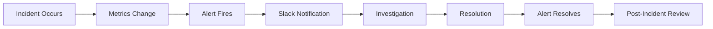

# Incident Scenarios

Overview of simulated incident scenarios for demonstrating SRE incident response practices.

---

## Purpose

This project includes three realistic incident scenarios that demonstrate:

- Incident detection and alerting
- Troubleshooting and diagnosis
- Resolution and recovery
- Post-incident review

Each scenario is fully scripted and can be run during demos or interviews.

---

## Available Scenarios

### 1. High Error Rate

**Trigger:** Load testing with flaky endpoint

**What Happens:**

- `HighErrorRate` alert fires
- Slack notification sent
- Grafana dashboard shows spike in Error rate %

**Duration:** ~2 minutes to detect, auto-resolves when load stops

**Skills Demonstrated:**

- Load testing with curl
- Error rate monitoring
- Alert configuration
- SLO tracking

**Run:**

```bash
# Generate errors

APP_URL=$(kubectl get svc sre-app -n sre-app -o jsonpath='{.status.loadBalancer.ingress[0].hostname}')

for i in {1..500}; do curl -s http://$APP_URL/api/flaky > /dev/null; sleep 0.3; done
```

### 2. High Latency

**Location:** `incidents/load-tests/`

**Trigger:** Load/stress testing

**What Happens:**

- `HighLatency` alert fires
- Slack notification sent
- Grafana dashboard shows spike in requests and latency

**Duration:** ~2 minutes to detect, auto-resolves when load stops

**Skills Demonstrated:**

- Load testing with k6
- High latency monitoring
- Alert configuration
- SLO tracking

**Run:**

```bash
cd incidents/load-tests
./run-spike-test.sh

# the following are also available
./run-load-test.sh
./run-stress-test.sh
```

**Detailed Documentation:** See `⁠incidents/load-tests/README.md`

### 3. Bad Code Deployment (Crash Loop)

**Location:** `⁠incidents/bad-code/`

**Trigger:** Deploy code that crashes on startup

**What Happens:**

- New pod enters CrashLoopBackOff
- Old pods remain healthy (rolling update protection)
- `HealthCheckFailing` alert fires after 1 minute for the new pod
- `⁠PodsDown` alert fires after 1 minute for the new pod
- Slack notification sent
- Rollback restores service

**Duration:** ~2 minutes to detect, ~30 seconds to rollback

**Skills Demonstrated:**

- Kubernetes rolling updates
- Pod crash detection
- Log analysis
- Deployment rollback
- Incident response

**Run:**

```bash
cd incidents/bad-code
./simulate.sh
```

**Detailed Documentation:** `See ⁠incidents/bad-code/README.md`

### 4. Bad Configuration Change

**Location:** `⁠incidents/bad-config/`

**Trigger:** Set deployment replicas to 0

**What Happens:**

- All pods terminate
- Application becomes completely unavailable
- `PodsDown` alert fires after 1 minute
- Slack notification sent
- Scaling back to 2 replicas restores service

**Duration:** ~1 minute to detect, ~2 minutes to recover

**Skills Demonstrated:**

- Configuration management
- Complete outage handling
- Kubernetes scaling
- Service recovery
- Change management importance

**Run:**

```bash
cd incidents/bad-config
./simulate.sh
```

**Detailed Documentation:** See `⁠incidents/bad-config/README.md`

---

## Incident Response Flow

All scenarios follow this pattern:



---

## Observability During Incidents

### Grafana Dashboard

**What to Watch:**

- Request Rate: Drops during outages, spikes during load
- Error Rate: Increases during failures (simulated with the `/flaky` endpoint)
- Latency: Increases under load
- Active Pods: Changes during scaling/crashes

### Prometheus Alerts

**Alert States:**

- **Inactive** (Green): Normal operation
- **Pending** (Yellow): Condition met, waiting for duration
- **Firing** (Red): Alert active, notification sent

### Slack Notifications

**Alert Format:**

```bash
[FIRING] AlertName
Alert: AlertName
Severity: critical/warning
Description: Detailed description
Summary: Brief summary
```

**Resolution Format:**

```bash
[RESOLVED] AlertName
Alert: AlertName
Severity: critical/warning
Description: Detailed description
Summary: Brief summary
```

---

## Demo Sequence

### Recommended Order for Demos

1. **Start with Load Test** (Scenario 1)
    - Shows normal operations
    - Demonstrates auto-scaling
    - Non-destructive

1. **Bad Code Deployment** (Scenario 2)
    - Shows Kubernetes protection
    - Demonstrates rollback
    - More realistic

1. **Bad Configuration** (Scenario 3)
    - Shows complete outage
    - Demonstrates recovery
    - Highlights change management

**Total Time:** ~15-20 minutes for all three

---

## Key Metrics to Highlight

### Before Incident

- Availability: 100%
- Error Rate: 0%
- Latency: p95 < 100ms
- Pods: 2/2 Ready

### During Incident

- Availability: Degraded or 0%
- Error Rate: Elevated
- Latency: May increase
- Pods: Varies by scenario

### After Resolution

- Availability: Restored to 100%
- Error Rate: Back to 0%
- Latency: Normal
- Pods: 2/2 Ready

---

## Talking Points

### Incident Detection

> *"I use Prometheus to continuously evaluate alert rules. When conditions are met for the specified duration, AlertManager routes notifications to Slack. This gives us immediate visibility into issues, often before users report them."*

### Incident Response

> *"My approach follows the incident response lifecycle: detect, diagnose, resolve, and learn. For this demo, I've automated detection with alerts. Diagnosis uses Grafana dashboards and kubectl commands. Resolution depends on the scenario - rollback for bad code, scaling for configuration issues. Finally, I document lessons learned."*

### Why Simulate Incidents?

> *"Practicing incident response in a safe environment builds muscle memory. These scenarios demonstrate that I understand not just how to build systems, but how to operate and troubleshoot them. In production, I'd also run game days and chaos engineering experiments to validate our incident response procedures."*

---

## Post-Incident Activities

After each scenario, review:

1. **Timeline**
    - When did the incident start?
    - When was it detected?
    - When was it resolved?
    - What was the MTTR?

1. **Impact**
    - How many requests failed?
    - What was the error budget impact?
    - Were users affected?

1. **Response**
    - Did alerts fire correctly?
    - Was the resolution appropriate?
    - What could be improved?

1. **Prevention**
    - How can we prevent this in the future?
    - What guardrails should we add?
    - Should we update runbooks?

---

## Extending the Scenarios

### Additional Scenarios (Not Implemented)

Ideas for future enhancements:

- **Resource Exhaustion**: Memory leak causing OOM kills
- **Network Issues**: Simulated network latency/packet loss
- **Dependency Failure**: External service unavailable
- **Security Incident**: Suspicious traffic patterns
- **Data Corruption**: Bad data causing application errors

---

## References

- Detailed scenario documentation in each `⁠incidents/*/README.md`
- Load test scripts in `⁠incidents/load-tests/`
- Simulation scripts in each incident directory
- Alert rules in `⁠k8s/monitoring/prometheus/alert-rules.yaml`
